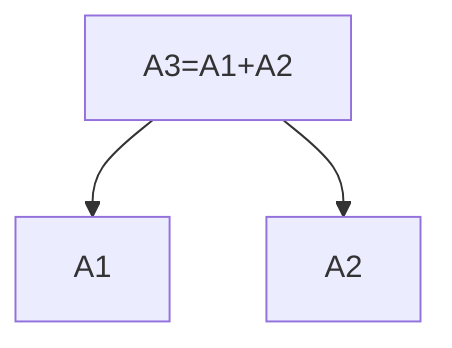
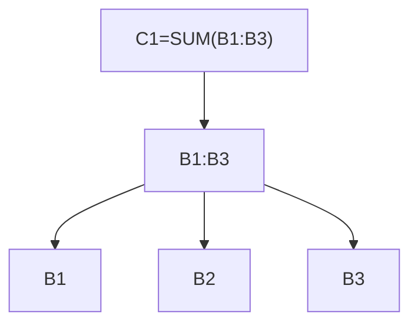

# Graphed Excel

  


Tool to analyze and visualize dependencies between cells in Excel spreadsheets in order to get an understanding of the complexity.

Will generate a graph of the dependencies between cells in an Excel spreadsheet. Data extracted with `openpyxl` (<https://foss.heptapod.net/openpyxl/openpyxl>), the graph is generated with the `networkx` library (<https://networkx.org/>) and is visualized using `matplotlib`.

<br clear="right"/>

## Definitions

Single-cell references in a formula sitting in cell `A3` like `=A1+A2` is considered a dependency between the node `A3` and the nodes `A2` and `A1`.



A range defined in a formula like `=SUM(B1:B3)` is kept as a single node in the graph, but all the containing cells are expanded as dependencies of the range node.

So when a cell, `C1` contains `=SUM(B1:B3)` the graph will look like this:



## Installation from pypi package

PyPi project: [graphedexcel](https://pypi.org/project/graphedexcel/)

```bash
pip install graphedexcel
```

## Installation from source

```bash

python -m venv venv
source venv/bin/activate
pip install -e .
```

## Usage

```bash
python -m graphedexcel <path_to_excel_file> [--verbose] [--no-visualize] [--keep-direction] [--open-image]
```

Depending on the size of the spreadsheet you might want to adjust the plot configuration in the code to to make the graph more readable (remove labels, decrease widths and sizes etc) - you can find the configuration in [graph_visualizer.py](src/graphedexcel/graph_visualizer.py) with settings for small, medium and large graphs. You can adjust the configuration to your needs - but this only working if you run from source.

### Arguments

`--verbose` will dump formula cell contents during (more noisy)

`--no-visualize` will skip the visualization step and only print the summary (faster)

`--keep-direction` will keep the direction of the graph as it is in the excel file, otherwise it will be simplified to an undirected graph (slower)

`--open-image` will open the generated image in the default image viewer (only on Windows)

## Sample output

The following is the output of running the script on the sample `docs/Book1.xlsx` file.

```bash
===  Dependency Graph Summary ===
Cell/Node count                70
Dependency count              100


===  Most connected nodes     ===
Range Madness!A2:A11           22
Range Madness!B2:B11           11
Range Madness!F1               10
Main Sheet!B5                   4
Main Sheet!B22                  4
Detached !A2:A4                 4
Range Madness!B2                4
Range Madness!B3                4
Range Madness!B4                4
Range Madness!B5                4

===  Most used functions      ===
SUM                             4
POWER                           1

Visualizing the graph of dependencies.
This might take a while...

Graph visualization saved to images/.\Book1.xlsx.png
```

## Sample plot

More in `docs/images` folder.


## Tests

Just run pytest in the root folder.

```bash
pytest
```

## Contribute

Feel free to contribute by opening an issue or a pull request.

You can help with the following, that I have thought of so far:

- Add more tests
- Improve the code
- Add more features
- Improve the visualization and the ease of configuration
- Add more examples
- Add more documentation
